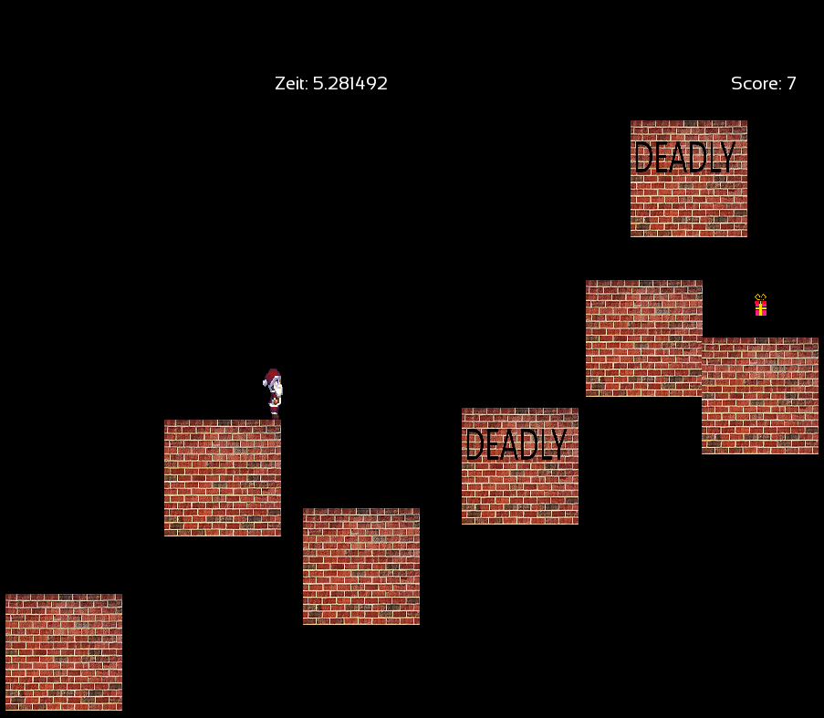

# General

This project was originally made from a friend and me for the C++ course at our university. It was made with the Visual Studio IDE and created as a Visual Studio Project (running it with any other IDE and/or buildsystem will probably require some adjustments). Apart from that, SFML (Simple and Fast Multimedia Library) was chosen as the graphics library. The project consists of two parts the Release folder and the source folder. The Release folder contains a compiled version of the project (C++Projekt.exe) that can be executed on windows through simply double clicking the .exe file. The source folder contains two more folders:

- SFML-2.5.0
- C++Projekt

The SFML-2.5.0 folder containts the dependencies of our used gui library.
The C++Projekt folder contains the actual source files (.h and .cpp) of the project itself and the resources folder. The resource folder contains all used assets like the font, the highscorelist and the textures.

